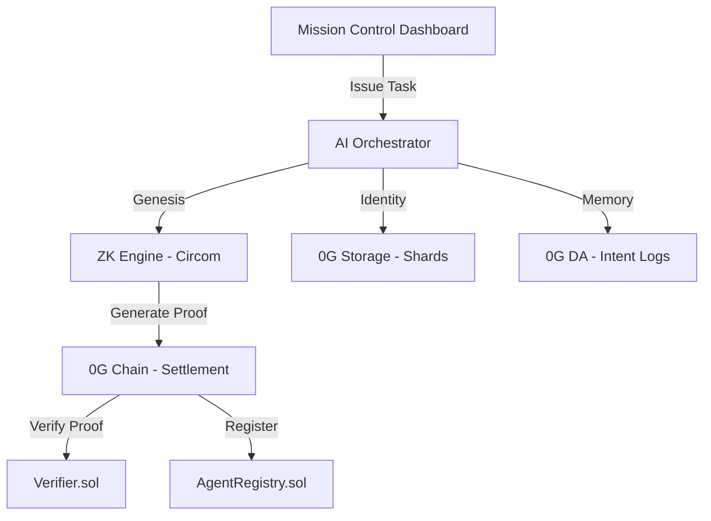

# Sovereign Agent Keys (SAK)

> **Verifiable AI Autonomy on the 0G Galileo Testnet**

[](https://chainscan-galileo.0g.ai)
[](https://evmrpc-testnet.0g.ai)
[](https://github.com/iden3/snarkjs)
[](#mvp-vs-production-readiness)

---

## 🌪️ The Sovereign Vision

Sovereign Agent Keys (SAK) is a decentralized infrastructure layer that allows AI agents to own their identity, assets, and memory. By leveraging **0G Labs'** high-performance DA and storage primitives alongside **ZK-SNARKs**, SAK ensures that agents are not just wallets, but governed entities with verifiable constitutions.

---

## 🏗️ Technical Architecture



### Module Breakdown:
| Module | Stack | Role |
|---|---|---|
| `contracts/` | Solidity 0.8.24 | AgentRegistry + Groth16 Verifier on 0G EVM |
| `zk-engine/` | Circom 2.1 | ZK circuit enforcing agent constitution rules |
| `ai-orchestrator/` | TypeScript + Ethers | Agent brain: MPC simulation, storage anchoring, proving |
| `mission-control/` | Next.js 15 + Tailwind v4 | Operator dashboard with fire-and-forget ZK pipeline |

---

## 📊 MVP vs. Production Readiness (Judge Transparency)

This project is a functional MVP developed for the 0G Labs Hackathon. To be transparent with our judges, here is the breakdown of what is live infrastructure vs. demo simulations:

### ✅ Fully Functional Infrastructure
- **ZK-SNARK Pipeline**: Real Groth16 proofs are generated locally using `snarkjs` and verified on-chain via the `AgentRegistry` contract.
- **On-Chain Settlement**: Agents are registered and tasks are permanently logged on the **0G Galileo Testnet**.
- **Fire-and-Forget Architecture**: Next.js API routes dispatch proving tasks to background processes, overcoming server-side timeouts and providing a smooth UI experience.
- **0G Storage Anchoring**: During the Genesis phase, agent identity metadata and shards are successfully uploaded to the **0G Storage** network.

### 🧪 Demo / Simulated Elements (MVP Scope)
- **MPC Key Sharding**: While we implement **Shamir Secret Sharing (2-of-3)** to split the agent's private key, the "MPC Nodes" are simulated within the orchestrator for this demo. In a production environment, these shards would be distributed across a network of independent signers.
- **Constitution Complexity**: The current ZK circuit enforces a hardcoded constitution (Spend Limit: 1000, Whitelist Address: Owner). Future iterations will support dynamic, user-defined constitution files converted into ZK-verifiable constraints.
- **Wallet Auth**: The `Sovereign Action` console is gated by wallet ownership on the frontend for demo purposes; production would require on-chain signature verification of the operator.

---

## 🛠️ Installation & Setup

1. **Clone & Install**: `npm install --workspaces`
2. **Environment**: Setup `.env` files in both `ai-orchestrator/` and `mission-control/`.
   - `PRIVATE_KEY`: Your wallet private key (used for server-side agent spawning).
   - `RPC_ENDPOINT`: `https://evmrpc-testnet.0g.ai`
3. **Launch**: 
   ```bash
   cd mission-control
   npm run dev
   ```

---

## 📡 Deployed Contracts (0G Galileo)

| Contract | Address |
|---|---|
| **AgentRegistry** | `0xFC2Cb6aF333934dBF2130fbaDa4979b54cBBdec0` |
| **Verifier (ZK)** | `0xdBE4c770673c4B86d27c2a1906d702027F4831c9` |

---

> *"An agent is only as powerful as its autonomy. True autonomy requires sovereignty."*
