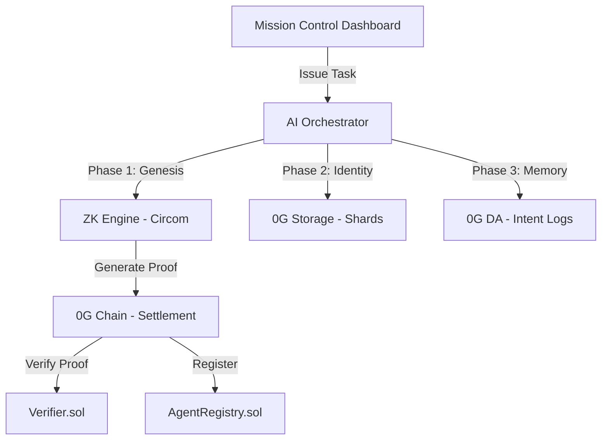

# Sovereign Agent Keys (SAK)

> **Verifiable AI Autonomy on the 0G Galileo Testnet**

---

## 🌪️ The Sovereign Vision

Sovereign Agent Keys (SAK) is a decentralized infrastructure layer that allows AI agents to own their identity, assets, and memory. By leveraging **0G Labs'** high-performance DA and storage primitives alongside **ZK-SNARKs**, SAK ensures that agents are not just wallets, but governed entities with verifiable constitutions.

### Why SAK?
- 🔐 **MPC Key Sharding**: Agent private keys are split via Shamir 2-of-3 secret sharing. Shards are stored securely on **0G Storage**, ensuring no single point of failure.
- 🛡️ **Verifiable Constitutions**: Every action must be mathematically proven (Groth16) against these rules before it can settle on-chain.
- 🧠 **Immutable Intent Memory**: Every decision is logged to **0G DA**, creating a permanent, audit-ready memory trail.

---

## 🛰️ Mission Control v2.0

The SAK Mission Control is a premium, low-latency dashboard designed for the next generation of AI operators.

### Key Features:
- **Genesis Orchestrator**: Real-time visualization of the ZK Genesis phase and 0G Storage anchoring.
- **Sovereign Command Console**: A terminal-style interface for issuing authorized instructions.
- **Vanta Waves Background**: High-fidelity animated UI for a next-level operator experience.
- **Live Telemetry**: Monitor 0G Testnet health, agent fleet integrity, and ZK proving performance.

---

## 🏗️ Technical Architecture

### Module Breakdown:
| Module | Stack | Role |
|---|---|---|
| `contracts/` | Solidity 0.8.24 + Hardhat | AgentRegistry + Groth16 Verifier on 0G EVM |
| `zk-engine/` | Circom 2.1 + snarkjs | ZK circuit enforcing agent constitution rules |
| `ai-orchestrator/` | TypeScript + `@0gfoundation/0g-ts-sdk` | Agent brain: MPC, storage, DA, proving |
| `mission-control/` | Next.js 16 + Tailwind CSS v4 | Operator dashboard with real-time telemetry |

---

## Deployed Contracts (0G Galileo Testnet)

| Contract | Address | Role |
|---|---|---|
| **AgentRegistry** | `0xFC2Cb6aF333934dBF2130fbaDa4979b54cBBdec0` | Core registry & verifiable task logger |
| **Verifier (ZK)** | `0xdBE4c770673c4B86d27c2a1906d702027F4831c9` | On-chain Groth16 Verifier (Circom export) |
| **0G Storage Flow** | `0x22E03a6A89B950F1c82ec5e74F8eCa321a105296` | 0G Native Storage Settlement |

---

## 🛠️ Quick Start Guide

1. **Clone & Install**: `npm install --workspaces`
2. **Environment Setup**: Add `PRIVATE_KEY` and `RPC_ENDPOINT` to `.env` in both `ai-orchestrator` and `mission-control`.
3. **Launch**: `cd mission-control && npm run dev`

---

> *"An agent is only as powerful as its autonomy. True autonomy requires sovereignty."*
